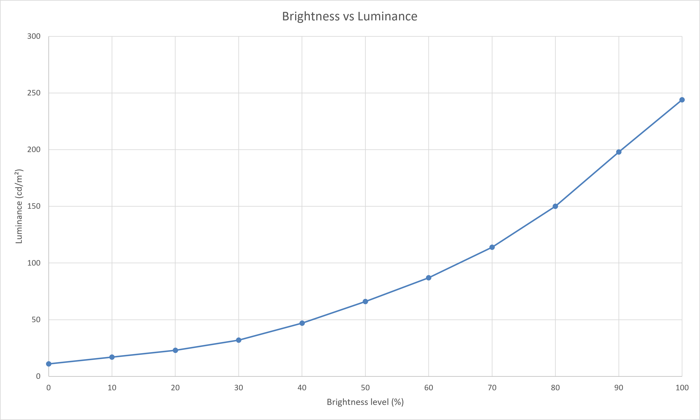

<!-- PAGE_STATUS: OK -->

# HP ProBook 450 G7    

15.6-inch 16:9 IPS display with a **BOE0852** panel and standard White LED backlight.

Calibration optimized for visual comfort using Spyder X and DisplayCAL.

Official product page: <https://www.hp.com/us-en/laptops/business/probook-400/product-card/hp-probook-450-g7.html>

## Table of contents

- [Specifications](#specifications)
  - [Color characteristics](#color-characteristics)
- [Calibration](#calibration)
  - [Environment and targets](#environment-and-targets)
  - [OSD settings](#osd-settings)
- [Downloads](#downloads)
  - [ICC/ICM profile](#iccicm-profile)
  - [Reports](#reports)
- [Brightness response curve](#brightness-response-curve)

## Specifications  

| Parameter          | Value            |
| ------------------ | ---------------- |
| Screen size        | 15.6"            |
| Panel type         | IPS              |
| Aspect ratio       | 16:9             |
| Resolution         | 1920 × 1080      |
| Backlight          | White LED (WLED) |
| Refresh rate       | 60 Hz            |
| Typical brightness | ~275 nits        |
| Contrast ratio     | ~900:1           |
| Viewing angle(H/V) | 178°(H)/178°(V)  |
| Response time      | ~21 ms           |

### Color characteristics  

**Gamut coverage**
|      Color gamut       | Declared/known coverage | Calibrated and measured coverage |
| :--------------------: | :------------------------: | :---------------------------------: |
| Wide color gamut (WDC) |             -              |                  -                  |
|          sRGB          |           ~ 58%            |               61.66%                |
|          NTSC          |           ~ 43%            |                  -                  |
|         DCI-P3         |           ~ 39%            |               43.99%                |
|       Adobe-RGB        |             -              |               42.79%                |
   
Color depth: 8 bit    

  <a href="#table-of-contents">⬆ Toc</a>

## Calibration  

Calibration objective: **Visual comfort with reduced eye strain during prolonged use.**  

### Environment and targets

**Calibration environment**
| Parameter        | Value                                 |
| ---------------- | ------------------------------------- |
| Calibration date | 2026-09-03                            |
| Instrument       | Spyder X                              |
| Software         | DisplayCal 3.8.9.3 ArgyllCMS 3.5.0 |

**Calibration target**
| Parameter          | Value              |
| ------------------ | ------------------ |
| Target white point | D65 (6500 K)       |
| Target gamma       | 2.2                |

  <a href="#table-of-contents">⬆ Toc</a>

## Downloads

### ICC/ICM profile
- [ICC profile](https://xdenb43.github.io/display-configuration-database/laptops/hp-probook-450-g7/BOE0852_D6500_2.2_M-S_XYZLUT_MTX.icm)

### Reports  
- [Verification report (HTML)](https://xdenb43.github.io/display-configuration-database/laptops/hp-probook-450-g7/Measurement_Report_BOE0852.html)
- [Verification report (PDF)](Measurement_Report_BOE0852.pdf)

  <a href="#table-of-contents">⬆ Toc</a>

## Brightness response curve

Post-calibration measurement with [ArgyllCMS/spotread](https://www.argyllcms.com/doc/spotread.html)

> [!NOTE]
> Recommended luminance levels:
>
> - Night: 80–100 cd/m²
> - Evening: 100–120 cd/m²
> - Daylight: 120–140 cd/m²
> - Bright daylight: 140–160 cd/m²

 

| OSD Brightness (%) | Luminance (cd/m²) |
| :----------------: | :---------------: |
|         0          |        11         |
|         10         |        17         |
|         20         |        23         |
|         30         |        32         |
|         40         |        47         |
|         50         |        66         |
|         60         |        87         |
|      -> 65 <-      |     -> 100 <-     |
|         70         |        114        |
|      -> 72 <-      |     -> 120 <-     |
|      -> 78 <-      |     -> 142 <-     |
|         80         |        150        |
|         90         |        198        |
|        100         |        244        |

  <a href="#table-of-contents">⬆ ToC</a>

