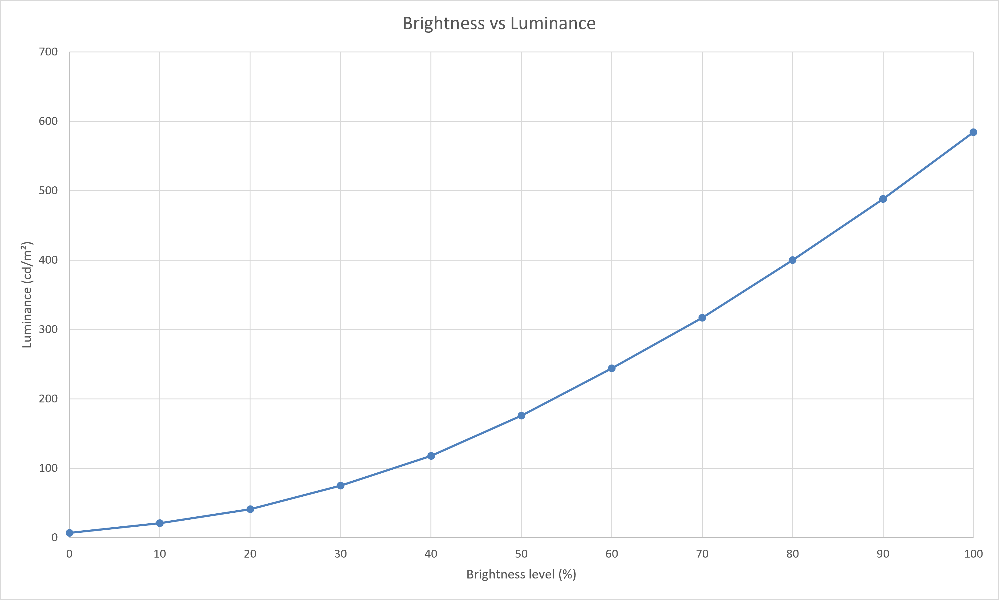

<!-- PAGE_STATUS: OK -->

# Huawei Matebook X Pro 2020 (MACHC-WAX9)   

Display panel: **JDI LPM139M422A**

13.9-inch 3:2 LTPS display with a JDI LPM139M422A panel and wide-gamut LED backlight.

Calibration optimized for visual comfort using Spyder X and DisplayCAL.

Official product page:  <https://consumer.huawei.com/ie/laptops/matebook-x-pro-2020/specs/>  

## Table of contents

- [Specifications](#specifications)
  - [Color characteristics](#color-characteristics)
- [Calibration](#calibration)
  - [Environment and targets](#environment-and-targets)
  - [OSD settings](#osd-settings)
- [Downloads](#downloads)
  - [ICC/ICM profile](#iccicm-profile)
  - [Reports](#reports)
- [Brightness response curve](#brightness-response-curve)

## Specifications  

| Parameter          | Value           |
| ------------------ | --------------- |
| Screen size        | 13.9"           |
| Panel type         | LTPS            |
| Aspect Ratio       | 3:2             |
| Resolution         | 3000 × 2000     |
| Backlight          | LED             |
| Refresh rate       | 60 Hz           |
| Typical brightness | 450 nits        |
| Contrast Ratio     | 1500:1          |
| Viewing Angle(H/V) | 178°(H)/178°(V) |
| Response time      | ~31 ms          |

### Color characteristics  

- Wide Color Gamut (WCG) declared by manufacturer  
- Known color gamut:  
    - sRGB: ~ 97–100%  
    - NTSC: Not specified  
    - DCI-P3: ~ 66–70%   
- Color depth: 8 bit    

## Calibration  

Calibration objective: **Visual comfort with reduced eye strain during prolonged use.**  

### Environment and targets

**Calibration environment**
| Parameter          | Value        |
| ------------------ | ------------ |
| Calibration date   | 2026-08-20   |
| Instrument         | Spyder X     |
| Software           | DisplayCal   |

**Calibration target**
| Parameter          | Value        |
| ------------------ | ------------ |
| Target white point | D65 (6500 K) |
| Target gamma       | 2.2          |
| Target luminance   | 120 cd/m²    |

### OSD settings  

- Display menu:  
    - Brightness: 40  
    - Display Manager -> Color Temperature: Default

## Downloads

> [!IMPORTANT]
> The ICC profile was created using the OSD settings listed above.
> Different monitor settings (brightness, RGB gain, contrast, etc.) may reduce color accuracy.

### ICC/ICM profile
- [ICC profile](https://xdenb43.github.io/display-configuration-database/laptops/huawei-matebook-x-pro-2020/LPM139M422A_120cdm2_D6500_2.2_M-S_XYZLUT_MTX.icm)

### Reports  
- [Verification report (HTML)](https://xdenb43.github.io/display-configuration-database/laptops/huawei-matebook-x-pro-2020/Measurement_Report_LPM139M422A.html)
- [Verification report (PDF)](Measurement_Report_LPM139M422A.pdf)

## Brightness response curve  

> [!NOTE]
> Recommended luminance levels:
>
> - Night: 80–100 cd/m²
> - Evening: 100–120 cd/m²
> - Daylight: 120–140 cd/m²
> - Bright daylight: 140–160 cd/m²

 

| OSD Brightness (%) | Luminance (cd/m²) |
| :----------------: | :---------------: |
|         0          |        7          |
|         10         |        21         |
|         20         |        41         |
|         30         |        75         |
|      -> 40 <-      |     -> 118 <-     |
|         50         |        176        |
|         60         |        244        |
|         70         |        317        |
|         80         |        400        |
|         90         |        488        |
|         100        |        584        |

  <a href="#table-of-contents">⬆ Top</a>

